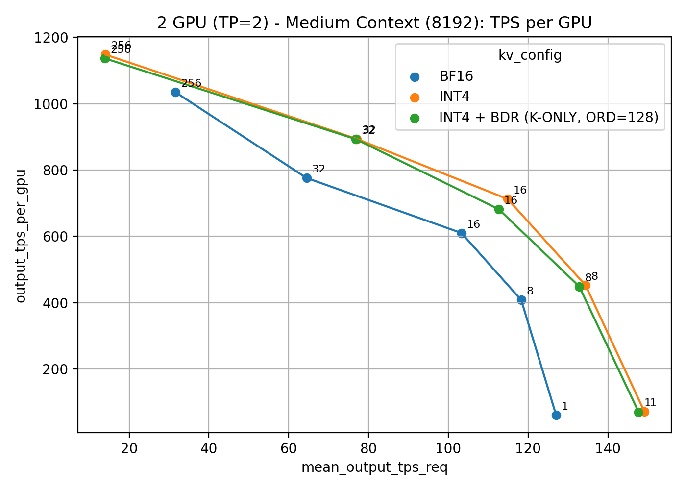

# saw-int4

saw-int4 is the official implementation of  
**<<SAW-INT4: System-Aware 4-Bit KV-Cache Quantization for Real-World LLM Serving>>**

This repository implements Block Diagonal Rotation (BDR) for KV-cache quantization, along with system-level optimizations that seamlessly integrate into SGLang. The resulting system achieves near-BF16 accuracy while preserving the end-to-end performance benefits of INT4.

## Contents

- [Introduction](#introduction)
- [How to run BDR](#how-to-run-bdr)
  - [Get the code](#get-the-code)
  - [Server requirements](#server-requirements)
  - [Install BDR (sglang-fast-rotation)](#install-bdr-sglang-fast-rotation)
  - [Run BDR](#run-bdr)
  - [Quick demo (verify your install)](#quick-demo-verify-your-install)
- [Primary accuracy and throughput](#primary-accuracy-and-throughput)
  - [Accuracy (primary)](#accuracy-primary)
    - [Prepare](#prepare)
    - [RUN-GPQA](#run-gpqa)
    - [Accuracy results (primary)](#accuracy-results-primary)
  - [Throughput and latency (primary)](#throughput-and-latency-primary)
    - [Prepare (genai-bench)](#prepare-genai-bench)
    - [Speed results (primary)](#speed-results-primary)
- [Ablation study (k-means, k-means + rotation)](#ablation-study-k-means-k-means--rotation)
  - [Install sglang-kmeans](#install-sglang-kmeans)
  - [KV calibration (ablation only)](#kv-calibration-ablation-only)
  - [Ablation method matrix](#ablation-method-matrix)
    - [Accuracy results (ablation)](#accuracy-results-ablation)
- [Repository layout](#repository-layout)
- [Full reproduction](#full-reproduction)
- [License](#license)

## Introduction

This work studies **4-bit KV-cache quantization** under **real serving constraints** such as paged memory layouts, regular memory access, and fused attention execution. Our primary method, **BDR (block-diagonal rotation)**, applies a **block-diagonal Hadamard rotation** to the KV cache before **token-wise INT4 KV-cache quantization**, implemented directly inside a **fork of [SGLang](https://github.com/sgl-project/sglang)**.

We ship two submodule branches on the same fork remote:

- **[third_party/sglang-fast-rotation](third_party/sglang-fast-rotation)** — **Our proposed BDR implementation:** fused block-diagonal rotation + INT4 KV-cache write. Use this fork for **both accuracy and throughput** on **BF16**, **INT4**, and **BDR** (the main paper numbers).
- **[third_party/sglang-kmeans](third_party/sglang-kmeans)** — **Ablation study for kmeans, kmeans+rotation:** KV dump, k-means centroids, and k-means + rotation variants. Not required to reproduce the core BDR vs BF16 vs INT4 story.

Pinned commits: [SUBMODULE_VERSIONS.md](SUBMODULE_VERSIONS.md).

## How to run BDR

This section covers everything needed to run BDR on **`third_party/sglang-fast-rotation`**: get the code, install, and launch a server.

### Get the code

```bash
git clone --recurse-submodules https://github.com/togethercomputer/saw-int4.git
cd saw-int4
```

If you cloned without submodules: `git submodule update --init third_party/sglang-fast-rotation`.

### Server requirements


The BDR implementation is built on top of the SGLang codebase and currently assumes the following setup:

- **MHA models only** — **MLA** and other non-MHA layouts are **not supported** for these KV / BDR settings.
- **Prefill backend:** **`fa3`**.
- **Decode backend:** **`triton`**.

### Install BDR

```bash
cd third_party/sglang-fast-rotation/python
pip install -e ".[all]"
pip install --no-build-isolation "git+https://github.com/Dao-AILab/fast-hadamard-transform.git"
```


### Run BDR

**BF16 KV (baseline)**
```bash
python -m sglang.launch_server \
  --prefill-attention-backend fa3 \
  --decode-attention-backend triton \
  --model-path "Qwen/Qwen3-4B-Thinking-2507" \
  --port 30000 \
  --kv-cache-dtype auto
```

**Original INT4 KV**
```bash
python -m sglang.launch_server \
  --prefill-attention-backend fa3 \
  --decode-attention-backend triton \
  --model-path "Qwen/Qwen3-4B-Thinking-2507" \
  --port 30000 \
  --kv-cache-dtype int4
```

**BDR (block diagnoal rotation on K)**
```bash
HADAMARD=1 HADAMARD_ORDER=128 python -m sglang.launch_server \
  --prefill-attention-backend fa3 \
  --decode-attention-backend triton \
  --model-path "Qwen/Qwen3-4B-Thinking-2507" \
  --port 30000 \
  --kv-cache-dtype int4
```

For the full env variable reference, and the complete mode matrix, see [docs/bdr_env_vars.md](docs/bdr_env_vars.md). 

### Quick demo (verify your install)

With the server running in **any** of the three modes above, run the smoke-test script from the repository root:

```bash
pip install openai   # if not already installed
python scripts/bdr_smoke_test.py --port 30001 --model Qwen/Qwen3-4B-Thinking-2507
```

The script sends a **GPQA sample question** to the server and streams the response. 

```
Server : http://0.0.0.0:30000/v1
Model  : Qwen/Qwen3-4B-Thinking-2507

--- Prompt (GPQA sample) ---
Answer the following multiple choice question.....
...

--- Response ---
<model reasoning and answer streamed here>
```


## Primary accuracy and throughput

**Accuracy** (simple-evals / GPQA) and **throughput** ([genai-bench](https://github.com/sgl-project/genai-bench)) both use **`third_party/sglang-fast-rotation`**; server setup is in [How to run BDR](#how-to-run-bdr). **Accuracy model:** **`Qwen/Qwen3-4B-Thinking-2507`**. **Throughput model:** **`Qwen/Qwen3-8B`** (override `MODEL_PATH` in scripts if you align checkpoints).

### Accuracy (primary)

#### Prepare

**Prerequisite (GPQA client):** **[openai/simple-evals](https://github.com/openai/simple-evals)** is included as a submodule at **`third_party/simple-evals`**.

```bash
git submodule update --init --checkout third_party/simple-evals
cd third_party/simple-evals
mkdir -p simple_evals
touch simple_evals/__init__.py
pip install openai pandas requests jinja2 tqdm numpy
```

Add a local model alias once in `third_party/simple-evals/simple_evals.py` inside the `models = { ... }` dictionary so `simple-evals` and set max_tokens=32768:

```python
"qwen3_4b": ChatCompletionSampler(
    model="Qwen/Qwen3-4B-Thinking-2507",
    system_message=OPENAI_SYSTEM_MESSAGE_API,
    max_tokens=32768,
),
```

#### RUN-GPQA
With **simple-evals** installed and the SGLang server already up (start it in the desired mode from [Run BDR](#run-bdr), using **`Qwen/Qwen3-4B-Thinking-2507`** as the model), point the client at **`http://127.0.0.1:<port>/v1`** and run GPQA:

```bash
cd third_party/simple-evals
export OPENAI_BASE_URL="http://127.0.0.1:30000/v1" 
export OPENAI_API_KEY="dummy"
python -m simple-evals.simple_evals --model qwen3_4b --eval gpqa --n-repeats 3
```


#### Accuracy results (primary)

| Model | Method | Benchmark | Score |
|-------|--------|-----------|-------|
| Qwen/Qwen3-4B-Thinking-2507 | BF16 | GPQA | 66.6667 |
| Qwen/Qwen3-4B-Thinking-2507 | INT4 | GPQA | 0 |
| Qwen/Qwen3-4B-Thinking-2507 | BDR-16 (K) | GPQA | 57.4074 |
| Qwen/Qwen3-4B-Thinking-2507 | BDR-64 (K) | GPQA | 64.3098 |
| Qwen/Qwen3-4B-Thinking-2507 | BDR-128 (K) | GPQA | 65.8249 |


### Throughput and latency (primary)

Speed results use **sglang-fast-rotation** (fused INT4 + BDR kernels) with **`Qwen/Qwen3-8B`**, driven by **[genai-bench](https://github.com/sgl-project/genai-bench)** against the server’s OpenAI-compatible HTTP API. Helper: [scripts/run_genai_bench_example.sh](scripts/run_genai_bench_example.sh) (default `MODEL_PATH`). Full CLI, traffic scenarios, Excel/plots: [GenAI Bench docs](https://docs.sglang.ai/genai-bench/getting-started/) and [Run benchmark](https://docs.sglang.ai/genai-bench/user-guide/run-benchmark/).

#### Prepare (genai-bench)

**Prerequisite (throughput client):** install genai-bench (separate from the SGLang venv if you prefer):

```bash
pip install genai-bench
```

Optional (quieter HF logs during tokenizer load): `export TRANSFORMERS_VERBOSITY=error`. For Docker / dev installs, see the upstream [installation guide](https://docs.sglang.ai/genai-bench/getting-started/installation/).

**Terminal 1 — server** (example BF16 KV):

```bash
cd third_party/sglang-fast-rotation/python
python -m sglang.launch_server \
  --prefill-attention-backend fa3 \
  --decode-attention-backend triton \
  --model-path "Qwen/Qwen3-8B" \
  --port 30000 \
  --kv-cache-dtype int4
```

**Terminal 2 — client** (after `pip install genai-bench`; matches ~256 input / 32 output tokens and concurrency 16 — see [traffic scenarios](https://docs.sglang.ai/genai-bench/user-guide/scenario-definition/)):

```bash
genai-bench benchmark --api-backend sglang \
  --api-base "http://127.0.0.1:30000" \
  --api-key "dummy" \
  --api-model-name "Qwen/Qwen3-8B" \
  --model-tokenizer "Qwen/Qwen3-8B" \
  --task text-to-text \
  --traffic-scenario "D(256,32)" \
  --num-concurrency 16 \
  --max-time-per-run 5 \
  --max-requests-per-run 200 \
  --server-engine "SGLang" \
  --server-gpu-type "local" \
  --server-version "custom" \
  --server-gpu-count 1
```

Tune `--max-time-per-run`, `--max-requests-per-run`, `--num-concurrency`, and `--traffic-scenario` using `genai-bench benchmark --help` and the docs above. Label runs with accurate `--server-gpu-type` / `--server-version` when publishing numbers.

**Sweep BF16 vs INT4 vs BDR:** restart the server with the right env and `--kv-cache-dtype`, then rerun **genai-bench** with **identical** client flags.

| Config | Env | `--kv-cache-dtype` |
|--------|-----|-------------------|
| BF16 KV | `HADAMARD=0` | `auto` |
| INT4 KV | `HADAMARD=0` | `int4` |
| BDR + INT4 | `HADAMARD=1` `ROTATE_V=0` `HADAMARD_ORDER=128` | `int4` |

SGLang’s built-in `bench_serving` ([bench_serving](https://github.com/sgl-project/sglang/blob/main/docs/developer_guide/bench_serving.md)) is optional; this repo standardizes on **genai-bench** for comparable sweeps and reporting.

**Hub:** [eval_speed/](eval_speed/)  
**Helper:** [scripts/run_genai_bench_example.sh](scripts/run_genai_bench_example.sh)

#### Speed results (primary)

Hardware: 2× H100 80 GB, TP=2. Model: `Qwen/Qwen3-8B`.  
Client: [genai-bench](https://github.com/sgl-project/genai-bench). Metric definitions: [eval_speed/metrics.md](eval_speed/metrics.md).  
Raw data: [eval_speed/results_summary_tp2_medium.csv](eval_speed/results_summary_tp2_medium.csv).

**Medium context — `D(8192, 1024)` (8 192 input / 1024 output tokens)**  
Cap: 20 min or 16–256 requests (varies by concurrency). Results: [eval_speed/results/20260417_144242/](eval_speed/results/20260417_144242/)

| KV config | Conc | output_tps(job) | mean_output_tps(req) | mean_ttft(req) (ms) | E2E mean(req) (s) | E2E p75(req) (s) | E2E p90(req) (s) | total requests | Wall (s) |
|-----------|-----:|----------------:|---------------------:|--------------------:|------------------:|-----------------:|-----------------:|---------------:|---------:|
| BF16      |   1 |   123.1 | 127.02 |   154.4 |  8.21 |  8.22 |  8.23 |  16 | 133.1 |
| INT4      |   1 |   143.6 | 149.14 |   168.6 |  7.03 |  7.02 |  7.04 |  16 | 114.1 |
| INT4 + BDR (K-only, ord=128) |   1 |   141.2 | 147.69 |   221.7 |  7.15 |  7.09 |  7.10 |  16 | 116.1 |
| BF16      |   8 |   815.7 | 118.29 |   785.3 |  9.44 |  9.54 |  9.60 |  16 |  20.1 |
| INT4      |   8 |   904.4 | 134.42 |   895.2 |  8.52 |  8.62 |  8.67 |  16 |  18.1 |
| INT4 + BDR (K-only, ord=128) |   8 |   897.6 | 132.83 | 1,038.7 |  8.75 |  8.92 |  9.01 |  16 |  18.3 |
| BF16      |  16 | 1,219.8 | 103.32 | 1,537.2 | 11.49 | 11.67 | 11.84 |  16 |  13.4 |
| INT4      |  16 | 1,424.6 | 114.91 | 1,521.1 | 10.47 | 10.63 | 10.72 |  16 |  11.5 |
| INT4 + BDR (K-only, ord=128) |  16 | 1,363.6 | 112.65 | 1,619.5 | 10.74 | 10.90 | 10.99 |  16 |  12.0 |
| BF16      |  32 | 1,552.5 |  64.46 | 3,017.9 | 18.98 | 19.31 | 19.56 |  32 |  21.1 |
| INT4      |  32 | 1,787.7 |  77.06 | 2,900.2 | 16.29 | 16.61 | 16.80 |  32 |  18.3 |
| INT4 + BDR (K-only, ord=128) |  32 | 1,786.3 |  76.82 | 2,888.6 | 16.32 | 16.64 | 16.83 |  32 |  18.3 |
| BF16      | 256 | 2,068.8 |  31.65 | 47,224.5 | 80.26 | 116.58 | 118.62 | 263 | 130.2 |
| INT4      | 256 | 2,296.3 |  14.05 | 22,392.8 | 97.93 | 100.79 | 102.49 | 257 | 114.6 |
| INT4 + BDR (K-only, ord=128) | 256 | 2,273.7 |  13.90 | 22,746.9 | 98.94 | 101.86 | 103.57 | 257 | 115.7 |



> **More results** (1× H100, TP=1, input 256 tokens and 16 k tokens): [eval_speed/tp1_results.md](eval_speed/tp1_results.md)

## Ablation study (k-means, k-means + rotation)

Use **`third_party/sglang-kmeans`**: KV dump for calibration, [tools/fit_kv_centroids.py](tools/fit_kv_centroids.py), then `SGLANG_KV_CENTROIDS_PATH` for **k-means + INT4** and **k-means + BDR** (optional `HADAMARD` / `ROTATE_V`). Accuracy still uses **simple-evals** from **`third_party/simple-evals`** ([Prepare](#prepare); run GPQA per upstream docs).

### Install sglang-kmeans

Not needed for primary BF16 / INT4 / BDR ([How to run BDR](#how-to-run-bdr)). Initialize the submodule (skipped by default), then install:

```bash
git submodule update --init third_party/sglang-kmeans
cd third_party/sglang-kmeans/python
pip install -e ".[all]"
pip install "flash-kmeans @ git+https://github.com/jindajia/flash-kmeans.git"
```

### KV calibration (ablation only)

Primary BF16 / INT4 / BDR does **not** need this step.

**1. Dump KV activations** — run from **sglang-kmeans** with a **BF16 KV cache** (`auto`) so dumps are in calibration space:

```bash
cd third_party/sglang-kmeans/python

export DUMP_KVCACHE=true
export DUMP_KVCACHE_TOKENS=512
export DUMP_KVCACHE_DIR=/path/to/kv_dumps

python -m sglang.launch_server \
  --prefill-attention-backend fa3 \
  --decode-attention-backend triton \
  --model-path "Qwen/Qwen3-8B" \
  --port 30000 \
  --kv-cache-dtype auto
```

Drive enough traffic so each layer hits the threshold at least once. Files appear as `kv_calibration_layer_<layer_id>.pt` (dict with `k`, `v`, `indices` on CPU; see `triton_backend.py` in the submodule for selection logic).

**2. Fit centroids offline** — from the **repository root**:

```bash
python tools/fit_kv_centroids.py \
  --dump-dir /path/to/kv_dumps \
  --out-dir /path/to/centroids_out \
  --n-clusters 16 \
  --seed 0
```

This writes `k_layer_L_clusters_<N>_centers.pt` and `v_layer_L_clusters_<N>_centers.pt` per global layer `L`, shaped `(N, num_kv_heads_global * head_dim)`, for loading in the submodule.

**3. Run INT4 + k-means inference**

```bash
export N_CLUSTERS=16
export SGLANG_KV_CENTROIDS_PATH=/path/to/centroids_out

python -m sglang.launch_server \
  --prefill-attention-backend fa3 \
  --decode-attention-backend triton \
  --model-path "Qwen/Qwen3-8B" \
  --port 30000 \
  --kv-cache-dtype int4
```

**K-means + BDR:** keep `SGLANG_KV_CENTROIDS_PATH`, set `HADAMARD=1`, optional `ROTATE_V`, and `HADAMARD_ORDER` consistent with head dimension (same as primary BDR).

### Ablation method matrix

| Method | `HADAMARD` | `ROTATE_V` | `HADAMARD_ORDER` | `--kv-cache-dtype` | `SGLANG_KV_CENTROIDS_PATH` | `N_CLUSTERS` |
|--------|------------|------------|------------------|---------------------|----------------------------|--------------|
| K-means + INT4 | `0` | `0` | n/a | `int4` | required | match files |
| K-means + BDR | `1` | `0` or `1` | set | `int4` | required | match files |

**K-means + INT4 example:**

```bash
cd third_party/sglang-kmeans/python
export OPENAI_API_KEY=dummy
export N_CLUSTERS=16
export SGLANG_KV_CENTROIDS_PATH=/path/to/centroids_out
export HADAMARD=0
export ROTATE_V=0
python -m sglang.launch_server \
  --prefill-attention-backend fa3 \
  --decode-attention-backend triton \
  --model-path "Qwen/Qwen3-8B" --port 30000 --kv-cache-dtype int4
```

**K-means + BDR example:**

```bash
export HADAMARD=1
export ROTATE_V=0
export HADAMARD_ORDER=16
export N_CLUSTERS=16
export SGLANG_KV_CENTROIDS_PATH=/path/to/centroids_out
python -m sglang.launch_server \
  --prefill-attention-backend fa3 \
  --decode-attention-backend triton \
  --model-path "Qwen/Qwen3-8B" --port 30000 --kv-cache-dtype int4
```

**Hub:** [eval_accuracy/](eval_accuracy/)  
**Helper:** `CENTROIDS=/path/to/centroids_out ./scripts/run_eval_matrix.sh kmeans` or `kmeans_bdr`.

#### Accuracy results (ablation)

| Model | Method | Benchmark | Score |
|-------|--------|-----------|-------|
| — | K-means + INT4 | — | — |
| — | K-means + BDR | — | — |

Fill from [eval_accuracy/results/](eval_accuracy/results/).

## Repository layout

| Path | Role |
|------|------|
| [third_party/sglang-fast-rotation/](third_party/sglang-fast-rotation/) | **Primary** BF16 / INT4 / BDR — accuracy + speed |
| [third_party/sglang-kmeans/](third_party/sglang-kmeans/) | **Ablation** k-means KV + dump / centroids |
| [third_party/simple-evals/](third_party/simple-evals/) | **GPQA accuracy client** (openai/simple-evals submodule; no separate clone needed) |
| [docs/bdr_env_vars.md](docs/bdr_env_vars.md) | Full BDR env variable reference and mode matrix |
| [scripts/](scripts/) | `bdr_smoke_test.py` (install smoke test), `run_primary_eval_matrix.sh`, `run_eval_matrix.sh`, `run_genai_bench_example.sh`, `clone_submodules.sh` |
| [tools/](tools/) | `fit_kv_centroids.py` (ablation calibration) |
| [eval_primary/](eval_primary/) | Primary **accuracy** logs / tables |
| [eval_speed/](eval_speed/) | Primary **throughput** logs / tables |
| [eval_accuracy/](eval_accuracy/) | Ablation **accuracy** logs / tables |

## Full reproduction

Large raw bundles may live outside this repo.

- **Full reproduction bundle:** *TBD — add URL*

Submodule SHAs: [SUBMODULE_VERSIONS.md](SUBMODULE_VERSIONS.md).

## License

See [LICENSE](LICENSE).
